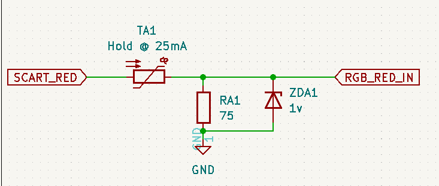

# TV Desecrator v6 schematics

This is what happens when a guy with a lot of money and no electronics expertise designs a circuit board. I'm writing this to explain how
the circuit works and also why I chose to implement the circuit this way.

## Power supply

The TV Desecrator runs at +5V. Although many TVs have a +5V rail (or +5.6V) for the MICOM circuit, I've found that the voltage regulators aren't
really meant to drive anything other than a standby load, and, being standby rails, are on all the time. So the TV Desecrator has a voltage regulator
onboard that's tied to some lower-voltage DC doohickery on the chassis. The voltage regulator is a LM2937IMP-5.0 or pin-compatible replacement.
Two 10uF ceramic caps stabilize the voltage going in and out of the regulator. Boring stuff, really.

## RGB inputs

RGB comes in off whatever device we have, then each channel goes through a PTC resettable fuse, has the 75 ohm pulldown applied, and is forwarded off
to the switcher. A zener (nominally 1V but can be 2V) is used to clamp the signal to ground in case of overvoltage.

Protecting the TV chassis is mission critical, and here's the first line of defense, where I at least try to prevent this. The idea is that if voltages
go too high, then the zeners will start clamping and drawing a few too many milliamps, causing the PTC fuses to stop the show. I had lost one TV to
JAMMA-level voltages and I wasn't about to let it happen again.

## SCART blanking voltage detection

This is where things get a little weird. I used an op-amp to detect the SCART blanking voltage mostly because of the odd voltages that could be
coming in on that line. It's supposed to be 75 ohm terminated, which I honored here, but even then the voltage might not be enough to trigger
the CMOS logic. Also, when I did my reading on typical SCART implementations, I read that some systems might use voltages higher than the 1-3VDC
that are typically present on this pin in RGB mode.

The reference voltage for the op-amp is set via a 10k potentiometer. It should be calibrated to as close to 1VDC as possible. Virtually every SCART
spec you'll find online says that a blanking voltage of 1-3VDC indicates RGB.

The blanking signal comes in through another PTC resettable fuse and is 75-ohm terminated, with a zener (nominally 5.6VDC) keeping watch over this
side of the circuit, because anything above 6 volts or so will make the op-amp very sad to the point where it kills itself. Upon going above the
reference voltage (which, again, should be 1VDC), the op-amp outputs a logical high signal; at all other times it is a logical low signal. This
signal is called SCART_BLANKING.

## RGB muxer logic

This ratsnest of logic computes:

    RGB_INHIBIT = !(SCART_BLANKING && RGB_SELECTED && !MICOM_BLANKING)
    RGB_IN_USE = !RGB_INHIBIT
    BLANKING_OUT = (RGB_IN_USE || MICOM_BLANKING)

This is done entirely using discrete 74-series logic chips, but could be unified into a single chip. As of yet, though, virtually
every single chip option would either be too expensive, overpowered, unreliable, or not +5VDC compatible.

Of particular interest is the RGB_SELECTED signal. This is a logical input from some other device indicating that the TV is set to the
right input and is ready for our RGB signal. This is something of a departure from other RGB muxer mods, which simply don't implement
this because there are too many cases to account for. That would add complexity, so I simplified it down to a single input and left it at
that. Jumpers on the board set this signal to active high (goes directly to the chips), or active low (input goes via an inverter).

## Switcher phase

RGB switching is performed by a TS5V330CDR 4-channel video switch. By default the switch allows the MICOM signal through, as RGB_INHIBIT
will normally drive the select pin high. When RGB_INHIBIT falls, the injected RGB signal passes through to the final output phase.

## Final output phase

The switched video goes through a THS7374, which I'm abusing here as a buffer. Since this circuit is functionally isolated from the
main RGB lines, we have to do the usual 75 ohm pulldown dance and buffer capacitor on the end. The pulldown is 220 ohms, which seems
odd but has been chosen to prevent the output RGB voltages from being halved, as they will be slightly above the 0.7VDC RGB levels by
the time they exit the amplifier. The caps are 0.47uF, chosen because they were a known value in my JVC, but had also been found to work
on other sets.

The THS7374 was originally added to the design because whatever switching logic would be in place would likely attenuate the signal
somewhat. The disable and lowpass features are not used at all; those pins are simply tied to ground. The obvious improvement here
is to replace it with a far cheaper chip, but this is the one I'm used to, so I'm just doing what I know works.

## Diagnostic lights

Finally there are the four diagnostic LEDs. They are:

* RED = +5V (power present)
* BLUE = SCART (SCART blanking signal detected)
* YELLOW = MICOM (MICOM blanking signal detected)
* GREEN = RGB (RGB in use)

All of the LEDs are current-limited using 1k resistors, which is enough to turn them on at non-obnoxious levels. The red LED is on all
the time as it's tied to the power supply. The others are all switched with N-channel MOSFETs so as not to drag the I/O logic low.
It's obvious that this design formerly used NPN transistors as the resistors limiting base current (sorry, *gate* current) are still there.
These resistors are most likely useless now and will be removed in future revisions.